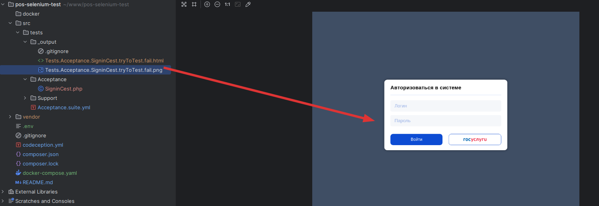
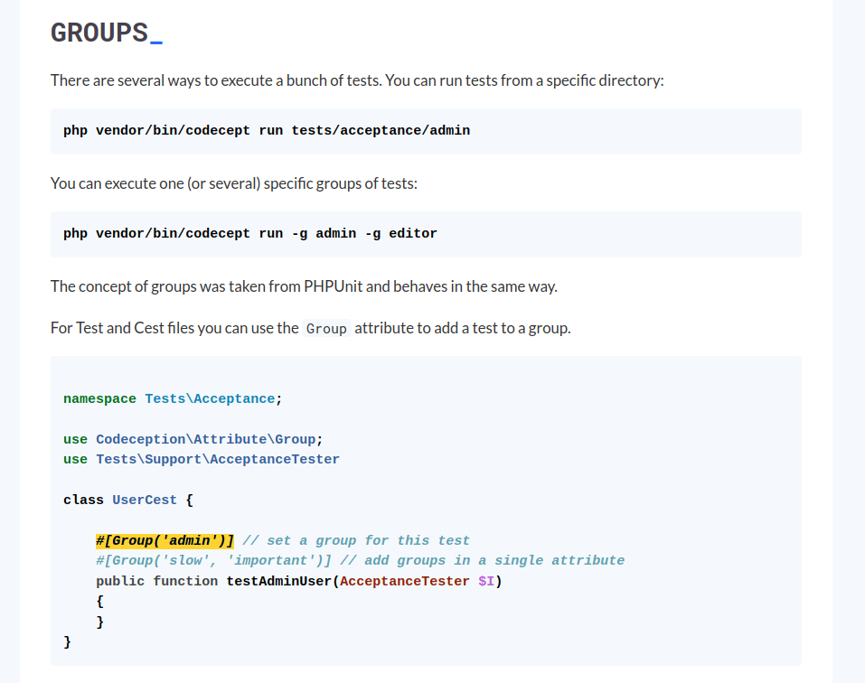

# selenuim test with codeception

## Docs
- https://codeception.com/quickstart
- https://codeception.com/docs/AcceptanceTests 

## Getting started

1. `git clone git@gitlab.maxitlab.com:og-dev/selenuim.git`
2. `make start`  |  или напрямую `docker-compose up -d`
3. `make runTest` | или напрямую `vendor/bin/codecept run`  - запуск всех тестов

# Configuration with .env file

## Переменные окружения:
TEST_DOMAIN - full domain name for tests, example: https://pos5.lko-dev.fid-team.ru/og

В тестах используем относительные пути к странице, например так 

- /login

В итоге этот относительный путь будет смаплен с TEST_DOMAIN из .env файла
получим нужную страницу:

https://pos5.lko-dev.fid-team.ru/og/login

Если нужно прогнать тесты на другом стенде - меняем TEST_DOMAIN на нужное значение

# !!! На проде не нужно тренироваться !!!

## Директория с логами tests/_output



## Все тесты пишем в директории /src/tests/Acceptance
внутри этой директории группируем по папкам тесты 
- Например тесты на авторизацию - группируем в /src/tests/Acceptance/Auth

## У нас есть разделение по ролям, поэтому тесты по ролям должны группироваться тоже, делаем так
  - /src/tests/Acceptance/Auth/Admin  
  - /src/tests/Acceptance/Auth/Federal
  - /src/tests/Acceptance/Auth/Regional
  - /src/tests/Acceptance/Auth/Municipal

Тестам навешиваем группу - https://codeception.com/docs/AdvancedUsage



потом будем запускать разные группы тестов 
```bash
# группа тестов для администратора
php vendor/bin/codecept run -g admin
# группа тестов для федерального уполномоченного
php vendor/bin/codecept run -g federal
# группа тестов для регионального уполномоченного
php vendor/bin/codecept run -g regional
# группа тестов для муниципала
php vendor/bin/codecept run -g muinicipal

# для всех ролей 
php vendor/bin/codecept run -g admin -g federal -g regional -g muinicipal

```

# Доступные команды 
- make runTest - запустить тесты
- make start - запустить все контейнеры
- make stop - остановить все контейнеры 
- make ls - выводит список запущенных контейнеров, из числа тех что указаны в docker-compose.yaml
- make stats - откроет статистику докера по потреблению памяти, процессорного времени и тп
- make logs - просто выведет последние логи
- make logsf - откроет логи на просмотр и будет держать открытыми пока не сбросишь сам через ctrl+c
- make connect - провалиться в сам контейрен (подключение к контейнеру с тестами)

Внутри контейнера можно запускать тесты через `./vendor/bin/codecept`
